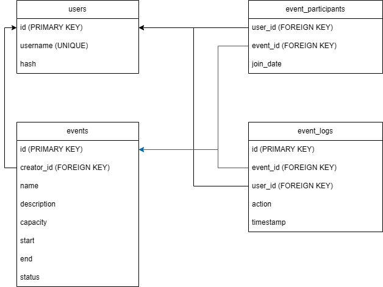

# Event-A: Event Management Website

__Video:__ [CS50 Final prjoect video](https://youtu.be/sjG-ysNFZOg)

__Description:__

Event-A is a simple event management website where users can join other events created by other users as well as create and manage their own events.

## Features

1. __User Account:__ Each user is required to create an account which is used to audit event attendance and participation.
2. __Voluntary Event Participation:__ Users can join and leave events created by other users.
3. __Event Creation & Management:__ Events can be updated by the creator, some of the management features available to the users are the following:
   - Display presenting all the current participants of an event.
   - Capability to _Kick_ specific users from the event.   
   - Display off all logs (_eg._ Who joined / left / got kicked from the event and when an event is created and updated).
   - Event Status:
    1. __Open__ - anyone is allowed to join.    
    2. __Ongoing__ - self explanatory.
    3. __Closed__ - cannot be joined.

Event-A is built using Python version 3.12.7 using the following modules and packages:

1. Flask
2. Flask-Session
3. sqlite3
4. re ( For regular expression )

__Frontend:__
HTML, CSS with BootStrap is used to design the website's pages.

__Backend:__
Flask serves as the back-end of the website with sqlite being used as the database.

## Installation & Usage

__Pre-requisites:__ Python, Git, Pip

1. Clone or Download the repository

```bash
git clone
```

2. Initialize and activate virtual environment
```bash
python -m venv .venv
```

3. Download the required packages/modules
```bash
pip install -r requirements.txt
```

4. Run run.py
```bash
python3 run.py
```
## Project Structure


```plaintext
Event-A/
├── database.db
├── readme.md
├── requirements.txt
├── run.py
└── App/                   # Main program logic
    ├── app.py
    ├── helpers.py
    ├── __init__.py
    ├── templates/         # Frontend Elements
    │   ├── create.html
    │   ├── find.html
    │   ├── index.html
    │   ├── layout.html
    │   ├── login.html
    │   ├── manage.html
    │   └── register.html
    └── static/            # CSS style
        └── style.css      
```
__run.py__ - Main program file where the program should be run.

__App/app.py__ - Contains all route configurations for the website (Backend).

__App/helpers.py__ - Contains all the program logic, database queries, and necessary formatting for the program.

## Functions & Processes

__Format:__ Functions are written in ```camelCase``` wheras variables are written in ```snake_case```.

### Fromatting Functions

1. formatDate(datetime) - converts a date from this format ```2025-5-12T05:00``` into ```05:00 12 May 2026``` as a string.

2. formatEvent(arguments) - returns a ```tuple``` used to insert / update data into the database.

### Data Retrieval Functions
Most of these functions are self explanatory.

1. Getting Event Data   
   - getuserJoinedEvents(user_id)
   - getUserNotJoinedEvents(user_id)
   - getUserCreatedEvents(user_id)
   - getEvent(event_id)
   - getEventParticipants(event_id)
   - getEventHistory(event_id)

Event Data is returned as following in ```JSON``` Format

```json
{
    "name": ____,
    "desc": ____,
    "capacity": ____,
    "start": ["unformated date-time", "formatted date-time"],
    "end": ["unformated date-time", "formatted date-time"],
    "status": ____,
    "id": ____,
    "attendees": ____
}
```

Event History is returned as following in ```JSON``` Format
```json
{
    "event_id": ____,
    "username": ____,
    "user_id": ____,
    "action": ____,
    "timestamp": ____
}
```

Event Participants is returned as following in ```JSON``` Format
```json
{
    "count": ____,
    "participants": {
        "username": ____,
        "id": ____
    }
}
```
2. Creating / Updating Event Data
    - addEvent(format_event)
    - updateEvent(format_event)
    - kickUserFromEvent(user_id, event_id)
3. User Data Functions
    - getData(user_id)
4. Data Logging
    - logNewUser(username, password)
    - logUserLeave(user_id, event_id)
    - logUserEventJoin(user_id, event_id)

## Database Design


## Author

Created by: Calix Gabriel Sindac
